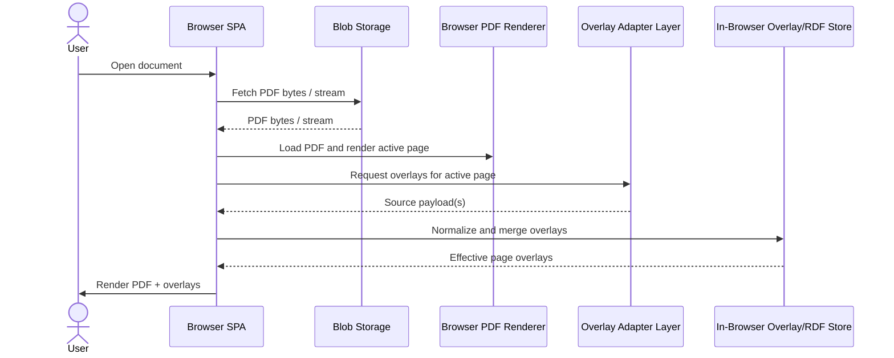
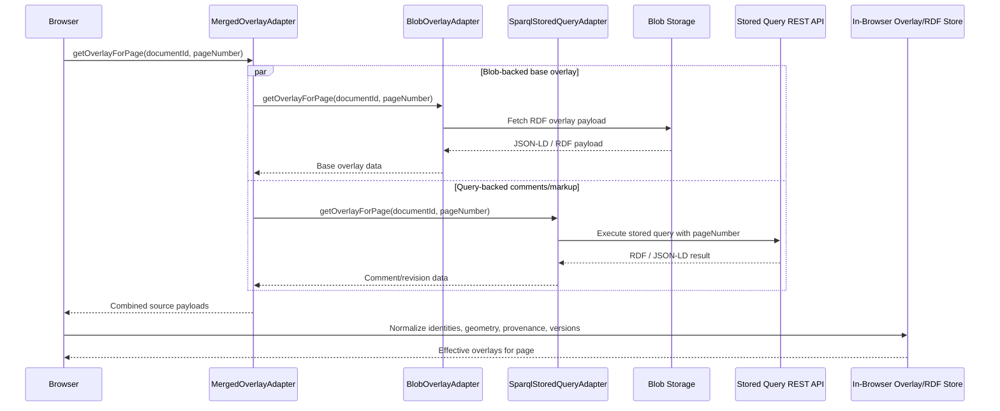
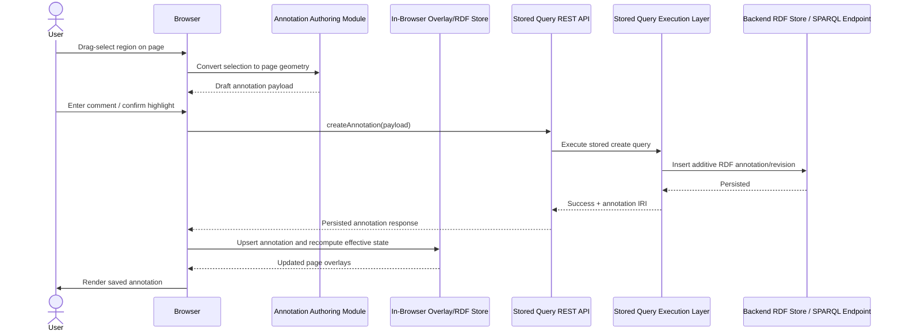
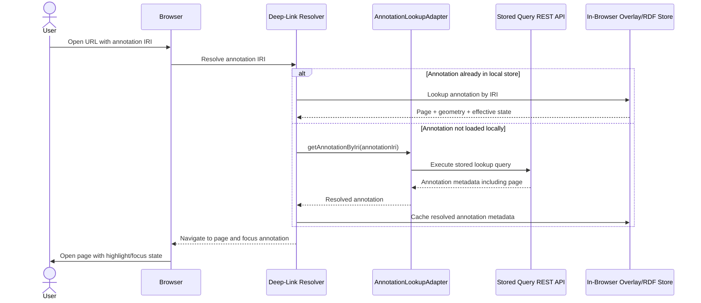

# PDF Overlay Viewer Rebuild Requirements Draft

## 1. Purpose

This document defines the target requirements for a rebuild of the PDF overlay viewer. It combines product requirements, use cases, technical requirements, architectural direction, and low-level design guidance so implementors understand both:

- what the application must achieve
- how key parts of the solution are expected to be structured

This is a rebuild specification, not a description of the current codebase alone. Where useful, it distinguishes:

- `Confirmed current capability`: behavior or patterns already demonstrated in this repository
- `MVP requirement`: required in the first rebuild release
- `Non-MVP requirement`: intentionally deferred, but the target architecture should not block it

## 2. Scope

The application is a browser-based PDF viewing and annotation client for documents whose OCR/overlay data is represented in RDF-compatible forms. It must support:

- retrieval of PDF content from remote blob storage
- retrieval of overlay/annotation RDF from multiple backends
- page-aware rendering of overlays over PDF pages
- OCR inspection and validation workflows
- additive annotation and correction workflows
- deep linking to specific annotations
- provenance-aware reading of current and historical annotation states

The rebuild should preserve the useful behavior already proven in this repository while replacing ad hoc test-page logic with stable architecture and clear interfaces.

For avoidance of doubt, the target delivery model is a single-page application running in the browser. PDF loading, page rendering, overlay rendering, and annotation interaction are expected to happen client-side, optionally using browser workers for heavy processing.

## 3. Confirmed Current Repository Capabilities

The current repository already demonstrates the following behavior or design patterns:

- browser PDF rendering with page navigation, zoom, and worker-based document processing
- overlay rendering on top of the PDF canvas
- support for overlay input as local JSON, JSON-LD, inline data, or per-page dynamic fetch
- an adapter/provider pattern for custom annotation rendering
- per-page annotation retrieval through an injected fetch function
- route/query-driven page selection
- route/query-driven annotation highlighting by annotation IRI
- JSON-LD transformation into an internal overlay model
- GeoSPARQL-style geometry handling via WKT/polygon conversion into page overlay coordinates
- OCR confidence visualization, including word/span-level confidence on hover
- vertical and horizontal inspection lines with intersection detection and tooltips
- proof-of-concept SPARQL-backed annotation retrieval
- proof-of-concept SPARQL update/revision workflows for cell editing

The current repository does not yet appear to provide a complete, production-ready implementation of:

- remote blob-based PDF retrieval as a first-class supported source
- page-by-page PDF retrieval using HTTP range requests / linearized PDFs
- a stable in-browser RDF store as a defined subsystem
- drag-to-select authoring of new annotations over the PDF
- a settled versioning/provenance data model for additive OCR corrections and annotations
- blob-range retrieval of RDF overlay page segments using byte offsets / ordered N-Triples

## 4. Product Goals

The rebuild must enable a user to:

- open a PDF from remote storage
- navigate to a page quickly
- see overlay data for that page
- inspect OCR output spatially and textually
- create annotations against areas on the page
- update or correct document-derived RDF through additive operations
- deep link to a specific annotation and open the document at the correct page and focus area
- understand current state versus historical revisions

The rebuild should also enable deployment into environments where overlay data may come from more than one source, including blob storage and SPARQL-backed services.

## 5. Primary Users

- document reviewers validating OCR output
- analysts reviewing extracted tabular or spatial document content
- users creating comments, highlights, and corrections against document regions
- systems integrators embedding the viewer into larger RDF / knowledge graph workflows

## 6. Core Use Cases

### 6.1 View a PDF from Remote Blob Storage

The user opens a document whose canonical binary PDF is stored in remote blob storage. The application loads the document into the browser and renders the requested page.

Expected outcomes:

- initial document load succeeds from a remote URL or brokered URL
- the application can navigate page to page
- the page view remains synchronized with overlay retrieval

### 6.2 View Page Overlays from a SPARQL-Backed Query Service

The user navigates to page `N`. The application requests overlay RDF for page `N` via a stored parameterized query exposed over REST.

Expected outcomes:

- page-specific overlay data is fetched on demand
- only data relevant to the active page is requested for MVP
- the overlay is rendered in the same internal model regardless of source

### 6.3 View Page Overlays from Blob Storage

The user navigates to page `N`. The application retrieves RDF overlay data stored in blob storage for the document and page.

Expected outcomes:

- overlay retrieval may return whole-document or page-scoped RDF depending on storage design
- the application normalizes the result into the internal overlay model

### 6.4 Merge Overlays from Multiple Sources

The application combines base OCR overlay data from blob storage with user annotations and comments from a queryable store.

Expected outcomes:

- users see a unified overlay view
- overlay provenance remains available
- merge rules are deterministic and auditable

### 6.5 Inspect OCR Text

The user validates OCR output by hovering on regions and by moving a vertical or horizontal inspection line through the page.

Expected outcomes:

- region hover reveals OCR text and confidence where available
- line inspection reveals intersecting OCR elements in reading order or spatial order
- the UI supports rapid review of OCR correctness

### 6.6 Create Annotations by Selecting an Area

The user drags over a region of the PDF page to select an area and creates an annotation such as:

- highlight
- comment
- correction target

Expected outcomes:

- selection geometry is captured in the same overlay model used by the viewer
- created annotations are persisted through the stored SPARQL query interface
- created annotations are immediately visible in the browser after successful save

### 6.7 Deep Link to an Annotation

The user opens a URL containing an annotation IRI. The application resolves that IRI to a page and focuses the relevant overlay.

Expected outcomes:

- the correct page opens
- the specified annotation is highlighted or focused
- if the annotation is not present in the initial page payload, it can be resolved via lookup

### 6.8 Review Current Version and History

The user views the current effective annotation/correction state by default, and can optionally inspect previous revisions and provenance.

Expected outcomes:

- current/effective overlays can be filtered from historical ones
- provenance metadata is available for display or inspection
- additive corrections do not overwrite original OCR data

## 7. Functional Requirements

### 7.1 PDF Retrieval

#### MVP

- The application must retrieve a PDF from remote blob storage.
- The application must support full-document PDF fetch into the browser.
- The application must support authenticated or pre-signed blob URLs, with credential strategy provided by the host environment.
- The application must render a requested page after the document is available in-browser.

#### Non-MVP

- The application should support page-by-page or partial PDF retrieval using HTTP range requests.
- The application should support optimized retrieval from linearized PDFs.
- The application should support resumable/cached byte-range fetching where feasible.

#### Mock / Prototyping Mode

- The application should support a plain mock-render mode that does not depend on a PDF library.
- In that mode, page surfaces may be provided as static page images, for example PNGs.
- The mock-render mode should still exercise the main interaction model:
  - page navigation
  - overlay rendering
  - hover and selection behavior
  - annotation creation/editing flows
  - deep-linking by annotation IRI
  - version/history display
- This mode is intended for functional prototyping, UI development, and automated testing.
- This mode is not a substitute for validating real PDF loading, real coordinate transforms, or real range-request behavior.

### 7.2 Overlay Retrieval

#### MVP

- The application must support page-aware overlay retrieval through an adapter architecture.
- The application must support the following overlay source types:
  - stored parameterized SPARQL query executed via REST
  - blob-stored RDF overlay payload
  - merged result from multiple adapters
- The application must normalize all source outputs into a single internal overlay representation before rendering.
- The application must support requesting overlay data for a specific page, for example `page=4`.

#### Non-MVP

- The application should support blob-based retrieval of page ranges using range requests over ordered RDF serialization.
- The application should support incremental loading of overlay segments without downloading the entire overlay blob.

### 7.3 Adapter Architecture

- Overlay retrieval must be implemented through pluggable adapters.
- Each adapter must declare:
  - source type
  - request parameters it accepts
  - output format it emits before normalization
  - error semantics
  - cacheability rules
- A merge adapter or merge orchestration layer must be able to combine the outputs of multiple adapters.
- Adapters must not directly manipulate rendering state; they return normalized or normalizable data.

Suggested adapter types:

- `SparqlStoredQueryAdapter`
- `BlobOverlayAdapter`
- `MergedOverlayAdapter`
- `AnnotationLookupAdapter` for annotation-IRI-to-page resolution

### 7.4 In-Browser Data Store

#### MVP

- The browser client must maintain an in-browser store for overlay and annotation data.
- The store must support:
  - page-scoped retrieval
  - lookup by annotation IRI
  - provenance fields
  - version/effective-state filtering
  - merge of multiple source payloads
- The store may be implemented with an RDF-capable library or a normalized application model, but it must preserve RDF semantics well enough to support provenance, identity, and geometry handling.

#### Preferred Direction

- An RDF-oriented in-browser store is preferred if it keeps query and merge logic coherent.
- Candidate implementations include an RDF graph store or an N3/RDF dataset approach.
- The implementation must be evaluated primarily on:
  - page-filter query cost
  - memory footprint
  - merge simplicity
  - ease of provenance/version filtering

### 7.5 Overlay Geometry and Spatial Semantics

- Overlay geometry must support page-region selection and rendering.
- GeoSPARQL must be used for geometry representation and interpretation where overlay RDF provides page geometries.
- The system must support polygon-based page geometry, including WKT-derived geometry.
- The internal rendering layer may transform geometry into a render-ready polygon/rect format, but source geometry semantics must be preserved.
- Geometry must be associated with page identity.

### 7.6 OCR Text Display and Validation

#### MVP

- Users must be able to hover over overlay regions to inspect OCR text.
- Users must be able to use a vertical or horizontal inspection line to inspect OCR output.
- OCR text inspection must support confidence display where available.

#### Preferred Behaviors

- line intersections should be orderable for predictable review
- hover and line views should display source text, confidence, and key semantic metadata
- the UI should support both compact tooltip inspection and a larger inspection panel if required

### 7.7 Annotation Authoring

#### MVP

- Users must be able to drag-select an area on a PDF page.
- The selected geometry must be convertible into the application’s overlay annotation format.
- Users must be able to create at least:
  - highlight annotations
  - comment annotations
- New annotations must carry stable IRIs.
- Newly created annotations must be represented as additive overlay RDF and must not overwrite original OCR RDF.

#### Post-save behavior

- On successful persistence, the annotation must appear in the current page view.
- The client must update local state without requiring a full document reload.

### 7.8 CRUD via Stored SPARQL Query Interface

#### MVP

- Create, update, and delete operations for annotations/corrections must be exposed through a stored SPARQL query interface callable through REST.
- The browser client must not embed large inline query logic as the primary production mechanism.
- The browser client must treat the REST interface as the initial execution target for stored query templates.

#### Non-MVP

- The same stored query behavior may later be exposed as a compiled browser-consumable library, but the rebuild must not depend on this being available.

### 7.9 Versioning, Provenance, and Additive Data Model

- The original OCR RDF must remain immutable from the client’s perspective.
- Corrections and user annotations must be additive.
- The data model must support distinguishing:
  - original OCR assertions
  - user annotations
  - corrections/revisions
  - superseded revisions
  - current effective view
- The application must support showing only the effective/current version by default.
- The application must support retrieving and displaying provenance/history when requested.
- The application must support deterministic rules for resolving which version is currently active.

Minimum provenance/versioning requirements:

- stable resource IRI for each annotation/revision
- relation from revision to prior state
- author/agent metadata where available
- created/generated timestamp
- source adapter/source graph identity
- effective/superseded status derivable through rules or query

### 7.10 Hyperlinking / Deep Linking

- The application must support URL parameters that identify a specific annotation by IRI.
- When an annotation IRI is provided, the application must:
  - determine the relevant page
  - navigate to that page
  - highlight or focus the annotation
- Deep linking must work for both current effective annotations and original OCR overlays where applicable.

### 7.11 Caching and State Management

- The client should cache PDF retrieval results when safe.
- The client should cache page overlay results by page and source adapter.
- Cache invalidation rules must exist for mutation operations.
- The application should avoid refetching unchanged page overlays during simple UI interactions.

## 8. Architectural Requirements

## 8.1 High-Level Components

- Browser SPA Shell
- Browser PDF Renderer
- Overlay Adapter Layer
- In-Browser Overlay/RDF Store
- Overlay Normalization Layer
- Annotation Authoring Module
- Stored Query REST Integration Layer
- Deep-Link Resolver
- Optional Host API / Auth Broker
- Remote Blob Storage
- Stored Query REST API

## 8.2 Logical Flow

### Read Flow

1. User opens document URL or document ID.
2. Browser resolves the PDF blob URL or document retrieval contract.
3. Browser loads PDF and renders current page.
4. Browser requests overlay data for current page via one or more adapters.
5. Adapter outputs are normalized and merged into the in-browser store.
6. Render layer queries the store for effective annotations on the active page.
7. Browser renders overlays and interaction affordances.

### Write Flow

1. User selects an area or chooses an existing annotation.
2. Browser creates a draft annotation/correction payload with geometry and metadata.
3. Browser invokes stored query REST endpoint for create/update/delete.
4. Backend persists additive RDF.
5. Browser receives confirmation and updates local store.
6. Effective-state rules are re-applied and the page re-renders.

### 8.2.1 Sequence Diagrams

#### High-Level Read Flow

#### Lower-Level Overlay Merge Flow

#### Lower-Level Annotation Authoring and Persistence Flow

#### Deep-Link Resolution Flow

## 8.3 Separation of Concerns

- PDF retrieval must be isolated from overlay retrieval.
- Overlay retrieval must be isolated from rendering.
- Rendering must consume normalized model data, not raw backend-specific payloads.
- Mutation logic must be isolated from the display layer.
- Deep-link resolution must not depend on already-loaded page state only; it must be able to resolve remotely if necessary.

## 9. Data Model Requirements

## 9.1 Canonical Client-Side Overlay Model

Regardless of source format, the browser must operate on a stable normalized model with fields equivalent to:

- annotation IRI
- annotation type
- page number / page IRI
- geometry
- display text / OCR text
- semantic properties
- provenance metadata
- versioning metadata
- source adapter/source graph
- effective/superseded indicators

This model may be rendered from RDF directly or projected from RDF into a view model.

## 9.2 Source RDF Expectations

The model should support source data representing:

- pages
- words
- lines
- cells
- tables
- figures
- user comments
- highlights
- correction resources
- revision/provenance relations

## 9.3 Geometry

Geometry must support:

- page-local coordinates
- polygon coordinates
- GeoSPARQL geometry resources
- transformation into render coordinates

## 9.4 Additive Revision Model

Recommended model characteristics:

- original OCR resource remains untouched
- a correction is represented as a new resource, not an overwrite
- the new resource references the prior resource
- effective-state filtering excludes superseded items by default
- provenance metadata can be shown in UI or exported

The exact ontology terms can be finalized later, but the rebuild must preserve this pattern.

## 10. API / Integration Requirements

## 10.1 PDF Retrieval Contract

The browser must be able to resolve a PDF by:

- direct blob URL
- document ID mapped to a blob URL through a host service

Future-friendly requirements:

- support pre-signed URLs
- support auth headers if the environment permits browser access
- support HEAD or metadata lookup when range retrieval is introduced

## 10.2 SPARQL Stored Query REST Contract

The stored-query interface should support operations such as:

- `getOverlayForPage(documentId, pageNumber)`
- `getAnnotationByIri(annotationIri)`
- `createAnnotation(payload)`
- `updateAnnotation(payload)`
- `deleteAnnotation(annotationIri)`
- `getAnnotationHistory(annotationIri)`

The client should treat the service as an application API, even if the service executes SPARQL underneath.

## 10.3 Blob Overlay Contract

For blob-stored overlay data, the system should support one of these storage strategies:

- whole-document RDF blob
- page-partitioned RDF blobs
- ordered RDF blob plus page-byte index

MVP can use whole-document or page-partitioned blobs. Ordered RDF plus byte-range retrieval is non-MVP.

## 11. Range Retrieval and Ordered Triple Design

This section is non-MVP but should shape the architecture now.

## 11.1 PDF Range Retrieval

The rebuild should be compatible with:

- HTTP range requests
- linearized PDFs
- lazy page loading

This implies:

- PDF retrieval should not assume the whole document is always loaded first
- the rendering pipeline should be able to work with partial fetch-capable loaders later

## 11.2 RDF Blob Range Retrieval

For blob-based page-range retrieval, the architecture should allow:

- RDF serialized in deterministic ordered triple blocks
- a sidecar page-to-byte-offset index
- location of first triple / byte offset per page or block
- retrieval of a page or page range without scanning the entire blob

Open design choices:

- whether the byte-offset register is stored as:
  - a sidecar JSON manifest
  - a sidecar RDF index graph
  - blob metadata plus sidecar manifest
- whether page blocks are organized per page, per object type, or per document section
- whether ordered N-Triples / N-Quads are sufficient or a different block format is needed

The rebuild should keep the overlay adapter contract general enough that this storage strategy can be added later without changing the rendering architecture.

## 12. Non-Functional Requirements

- The viewer should feel responsive during page navigation.
- Overlay fetch for a page should not block basic PDF rendering longer than necessary.
- Failures in one overlay source should degrade gracefully when another source still succeeds.
- The application must preserve stable annotation identity across sessions and deep links.
- The application should support large documents and large overlay sets through page scoping and caching.
- The application must avoid destructive mutation of source OCR data.
- The architecture should support embedding inside a host application.

## 13. Error Handling Requirements

- If PDF retrieval fails, the user must receive a clear document-load error.
- If one overlay source fails, the application should still render PDF content and any successful overlay sources.
- If merge conflicts occur, the application must apply deterministic precedence rules and log or expose conflict details for diagnostics.
- If deep linking cannot resolve an annotation IRI, the user should receive a specific not-found state.
- If a mutation request fails, the client must not present the failed change as committed state.

## 14. Security and Trust Boundaries

- Blob and query endpoints may require environment-specific authentication; the browser client should consume provided credentials or signed URLs rather than own credential issuance.
- Stored query REST endpoints must validate allowed operations server-side.
- Client-side mutation requests must not be trusted to enforce provenance or revision rules by themselves.
- If comments/annotations may contain rich text, rendering must prevent unsafe content execution.

## 15. Observability and Diagnostics

The rebuilt system should expose enough diagnostics to support integration and debugging:

- source adapter used for a page
- page overlay fetch timings
- counts of overlays loaded per source
- merge result counts
- mutation request status
- deep-link resolution status

## 16. Testing Approach

The rebuild should define a layered testing strategy rather than rely on browser-manual validation alone.

Recommended test layers:

- unit tests for geometry transformation, overlay normalization, merge rules, effective-state/version filtering, and deep-link resolution logic
- component/integration tests for browser PDF rendering, overlay rendering, page navigation, and annotation authoring interactions
- adapter integration tests for blob-backed overlay retrieval and stored-query REST retrieval/mutation flows
- end-to-end tests for the main user journeys:
  - open document
  - navigate to page
  - load overlays from one or more sources
  - deep-link to annotation IRI
  - create/update annotation
  - view effective version only

The project should include a plain mock surface mode, for example image-backed pages with no PDF library, so most UI and workflow behavior can be exercised independently of the real PDF runtime.

That mock mode should be used heavily in browser automation, including `Playwright`, to validate:

- page navigation flows
- overlay rendering and interaction behavior
- annotation creation/editing UX
- deep-link handling
- effective-version/history presentation
- merged source display behavior

Playwright coverage should then be complemented by a smaller set of tests against the real PDF rendering path, so the mock mode accelerates coverage without becoming the only test substrate.

At least one integration-test layer for Azure-facing storage components should run against `Azurite` rather than mocks alone.

That Azurite-backed layer should be used to validate:

- PDF retrieval from Azure Blob Storage-compatible endpoints
- blob-backed overlay retrieval
- expected handling of blob paths, containers, and metadata
- behavior relevant to future range-request support where feasible

Mocks are still useful for fast unit tests, but Azure storage integration should not be validated only with mocks.

## 17. MVP Summary

The MVP rebuild must provide:

- remote blob PDF retrieval
- browser PDF rendering with page navigation
- page-specific overlay retrieval
- overlay adapter architecture
- support for SPARQL stored-query REST overlay retrieval
- support for blob-stored overlay retrieval
- merge of multiple overlay sources
- in-browser overlay/RDF-capable store
- GeoSPARQL-aware geometry handling
- hover OCR inspection
- vertical/horizontal line OCR inspection
- drag-select area annotation creation
- create/update/delete through stored-query REST interface
- additive annotation/correction data model
- effective/current-version filtering
- annotation provenance/history model support
- deep linking by annotation IRI

## 18. Non-MVP Summary

- PDF byte-range / linearized retrieval
- blob overlay page-range retrieval by byte offsets over ordered triples
- compiled browser library alternative to REST stored-query execution
- more advanced history browsing and diff visualization

## 19. Open Design Questions

- Which in-browser store approach is preferred: RDF-native graph store, N3 dataset, or normalized application store with RDF projection?
- What is the canonical ontology vocabulary for additive corrections, revision chains, and effective-state filtering?
- How should page resolution for `annotation IRI -> page` be handled when the page is not known locally?
- Should blob overlays be stored per page for MVP, or as a whole-document blob plus client filtering?
- What exact merge precedence rules apply when blob data and SPARQL data both define overlays for the same region or resource?
- Should authoring support only rectangular selection in MVP, or polygon selection from the start?
- Does delete mean hard delete, tombstone, or superseded-by state in the additive model?

## 20. Implementation Guidance

Recommended implementation order:

1. define the normalized overlay model and version/provenance rules
2. define the adapter interfaces and merge behavior
3. implement a mock surface mode using static page images and shared overlay interaction logic
4. use that mode to develop and validate navigation, overlay rendering, authoring, and deep-link flows
5. implement PDF retrieval and real PDF page rendering
6. implement page-scoped overlay loading from SPARQL REST and blob sources
7. implement in-browser store and rendering query layer
8. implement deep linking by annotation IRI
9. implement drag-select authoring
10. implement mutation flows through stored-query REST
11. add history/provenance views
12. design non-MVP range retrieval/indexing extensions

## 21. Notes for the Next Draft

This draft intentionally captures requirements and architecture together. The next revision could split into:

- product requirements
- architecture/design spec
- data model / ontology profile
- API contracts

That split is only necessary if multiple teams need separate implementation artifacts.
